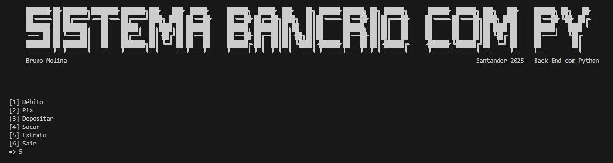
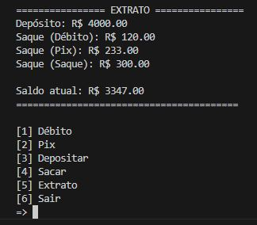
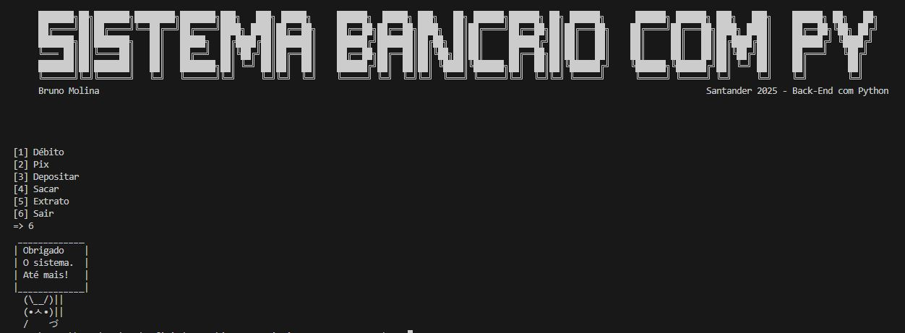

# sistema-bancario-python

# 💳 Sistema Bancário em Python

   
 Bruno Molina - Santander 2025 - Back-End com Python

---

## 📌 Sobre o Projeto
Este é um sistema bancário simples desenvolvido em **Python**, como parte dos estudos do **Santander Bootcamp 2025 - Back-End com Python**.  
O projeto simula operações bancárias básicas, como depósitos, saques, Pix, débito e exibição de extrato.

---

## 🚀 Funcionalidades
- ✅ **Depósito** com validação de valores  
- ✅ **Saque comum, Pix e Débito** com limites individuais  
- ✅ **Controle de limite diário de saques**  
- ✅ **Extrato detalhado** das operações  
- ✅ **Tratamento de erros** (entrada inválida, saldo insuficiente, limites)  
- ✅ **Interface interativa no terminal** com menu e ASCII Art  

---

## 📂 Estrutura do Código

depositar() → Função para realizar depósitos

sacar() → Função para realizar saques (Pix, Débito, Comum)

exibir_extrato() → Mostra as movimentações e saldo atual

Loop principal → Exibe menu interativo para o usuário
